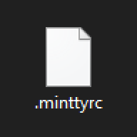

# minttyrc



Custom `.minttyrc` file for *Git Bash*.

You just have to put this file at `$HOME/.minttyrc` to get a nice *Git Bash* terminal with nice settings.

> :warning: **Warning**: please make a backup of your existing `.minttyrc` before, if you don't know what you're doing.

In alternative, you can use the following *Bash* command:

```bash
curl -o "$HOME/.minttyrc" https://raw.githubusercontent.com/dmotte/minttyrc/master/.minttyrc
```

## Git Bash installation advice

My favourite way of installing *Git Bash* on *Windows 10* is using the **Chocolatey** package manager:

1. [Install *Chocolatey*](https://chocolatey.org/install);
2. Open an elevated shell prompt;
3. Type the following command:
   ```cmd
   choco install -y gsudo git
   ```
   > **Note:** the `gsudo` package is useful whenever you want to execute privileged commands from a normal *Git Bash* shell (but it actually works also in other shells) (e.g. `sudo choco install -y otherpackage`)
